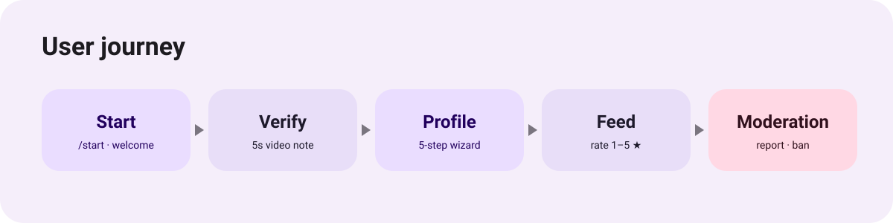
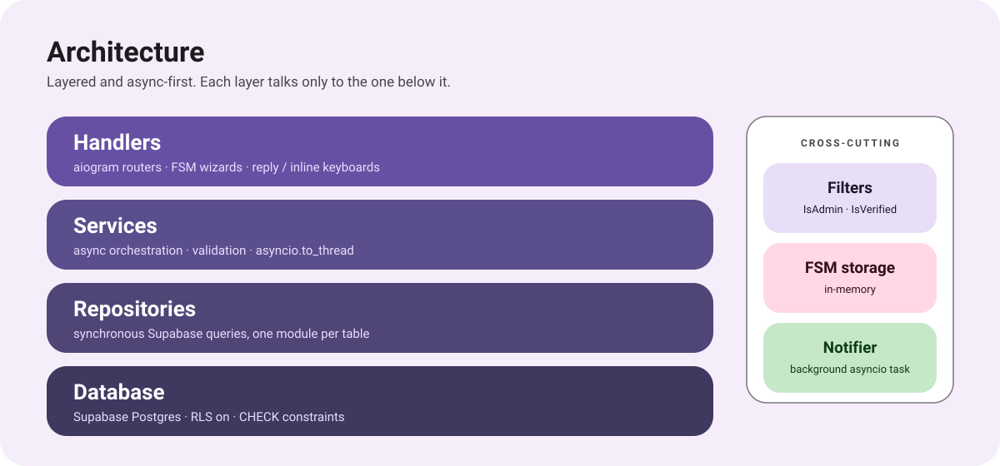

# RateMat

> A Telegram dating bot where a verified community — not an algorithm — decides who stands out.


## Overview

RateMat is a Telegram bot for dating built around one idea: every profile is scored
**1–5 ⭐ by real, video-verified people**, and the feed leans on those ratings instead
of a black-box match score. Access is gated behind a short liveness check, so the
people rating and being rated are all confirmed humans.

The product is Ukrainian-facing — all user copy is in Ukrainian — while the codebase
and tooling are in English.

## User journey



1. **Onboarding.** `/start` shows a welcome card and a single call to action.
2. **Verification.** The user records a video note (≤ 5 seconds). It lands in a
   moderation queue; an admin approves or rejects it. Only verified users continue.
3. **Profile creation.** A five-step FSM wizard collects name, age, gender, photo and
   description. Every limit is enforced both in code and as a Postgres `CHECK`
   constraint.
4. **Rating feed.** Profiles are shown one at a time. The user rates with a reply
   keyboard of ⭐ … ⭐⭐⭐⭐⭐. Unrated profiles come first; once they run out, previously
   rated profiles cycle back with the earlier score shown.
5. **Complaints.** Any profile in the feed can be reported with a free-text reason. A
   snapshot of the reported profile — photo and username — is stored with the
   complaint so moderation is not affected by later edits or deletions.

## Moderation

Admins are identified by Telegram ID. The admin surface is a reply keyboard with three
sections:

- **Verification queue** — video note plus a card, approve / reject, arrow navigation.
- **Complaint queue** — the reported photo and reason, with **ban** or **keep**.
- **Analytics** — user totals, growth over 24h / 7d, a breakdown by verification
  status, and the number of open complaints.

A background task polls the verification queue and pings every admin **once** when a
queue forms from empty, so there is no repeated noise.

## Architecture



The code is layered and async-first; each layer depends only on the one below it.

| Layer | Responsibility |
| --- | --- |
| `app/handlers` | aiogram routers, FSM wizards, keyboard wiring |
| `app/services` | async orchestration, validation, `asyncio.to_thread` boundaries |
| `app/database/repositories` | synchronous Supabase queries, one module per table |
| `app/database/client` | Supabase client, service-role key |

Cross-cutting pieces sit alongside: custom filters (`IsAdmin`, `IsVerified`),
in-memory FSM storage, and the background admin notifier.

## Data model

| Table | Purpose |
| --- | --- |
| `users` | Telegram identity and a `verification_status` state machine: `pending_start → awaiting_video → pending_review → verified / rejected / banned` |
| `profiles` | one profile per user, cascade-deleted with the user |
| `profile_ratings` | one score per `(rater, target)` pair, upserted on re-rating |
| `complaints` | reporter, target, reason, photo/username snapshot, status `open → resolved_ban / resolved_dismiss` |
| `admins` | Telegram IDs with moderation access |

Schema lives in [`migrations/`](migrations) as ordered SQL files. Row-level security is
enabled on every table with no policies, so all access goes through the service-role
key, and `CHECK` constraints act as a second validation layer behind the services.

## Tech stack

- Python 3.12, aiogram 3.13
- Supabase (Postgres) via `supabase-py`
- Long polling — no webhook, no Docker

## Project layout

```
run.py                     entrypoint (long polling + notifier task)
app/
  config.py                settings from .env, asset paths
  bot.py                   Bot / Dispatcher factories
  handlers/                routers: start, verification, profile, admin
  services/                business logic
  database/repositories/   table access
  keyboards/               reply and inline keyboards
  states/                  FSM state groups
  texts/                   Ukrainian user-facing copy
migrations/                ordered SQL migrations
assets/photos/             static media
docs/                      README diagrams
```

## Conventions

- All user-facing copy is Ukrainian and isolated in `app/texts/`.
- No inline comments — readability comes from naming, type hints and module
  boundaries.
- Modules stay small and single-responsibility; no god objects.
